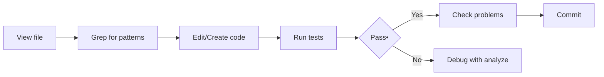
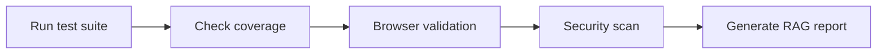
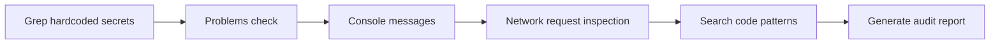

# Copilot Tool Capability Mapping

This document maps Gemini agent roles to available VS Code Copilot tools and defines how each tool should be used in the development workflow.

---

## Tool-to-Agent Mapping

### Browser Tools
| Tool | Primary Agent | Usage |
|------|--------------|-------|
| `browser_navigate` | ux-designer, qa-engineer | Test page rendering, validate layouts |
| `browser_snapshot` | ux-designer, frontend-dev | Get accessibility tree for validation |
| `browser_take_screenshot` | qa-engineer, ux-designer | Visual regression testing |
| `browser_click` | qa-engineer | Interactive test automation |
| `browser_type` | qa-engineer | Form input testing |
| `browser_console_messages` | security-auditor | Detect console errors/warnings |
| `browser_network_requests` | integration-engineer | API call validation |

### Code Intelligence Tools
| Tool | Primary Agent | Usage |
|------|--------------|-------|
| `grep` | architect, security-auditor | Search codebase for patterns, hardcoded values |
| `glob` | architect, db-engineer | Find files by pattern (schemas, configs) |
| `view` | tech-writer, code-reviewer | Read file contents for documentation |
| `edit` | frontend-dev, backend-dev | Apply code changes surgically |
| `create` | backend-dev, db-engineer | Create new files (models, schemas) |
| `problems` | qa-engineer, security-auditor | Check for compilation/lint errors |
| `usages` | refactor-specialist | Find all references to a symbol |
| `rename` | refactor-specialist | Safe rename across codebase |

### Repository Tools
| Tool | Primary Agent | Usage |
|------|--------------|-------|
| `github-mcp-server-list_issues` | release-manager | Track bug backlog |
| `github-mcp-server-list_pull_requests` | code-reviewer | Review pending changes |
| `github-mcp-server-search_code` | architect | Find code patterns across repos |
| `github-mcp-server-get_file_contents` | tech-writer | Read documentation files |
| `github-mcp-server-commits` | release-manager | Track change history |

### Task & Agent Tools
| Tool | Primary Agent | Usage |
|------|--------------|-------|
| `task` (explore) | initiator, architect | Research and discovery tasks |
| `task` (general-purpose) | backend-dev | Complex multi-step implementations |
| `task` (code-review) | code-reviewer | Automated PR review |
| `task` (security-review) | security-auditor | Security vulnerability scanning |
| `write_agent` | All agents | Send follow-up messages to running agents |
| `read_agent` | All agents | Retrieve agent results |
| `list_agents` | release-manager | Monitor agent status |

### Execution Tools
| Tool | Primary Agent | Usage |
|------|--------------|-------|
| `powershell` | devops, db-engineer | Run build scripts, migrations |
| `runTests` | qa-engineer | Execute test suites |
| `pylance-mcp-server-pylanceRunCodeSnippet` | backend-dev | Quick Python validation |
| `pylance-mcp-server-pylanceAnalyze` | backend-dev | Python type checking, debugging |
| `sql` | db-engineer | Database queries, migrations |
| `createAndRunTask` | devops | Define and run build/deploy tasks |

---

## Tool Usage Rules by Agent

### security-auditor Tool Checklist
```
[x] Use grep to search for 'password', 'secret', 'api_key' patterns
[x] Use problems to check for lint/security warnings
[x] Use browser_console_messages to detect runtime errors
[x] Use browser_network_requests to inspect API calls
[x] Use search_code to find hardcoded values across repos
```

### qa-engineer Tool Checklist
```
[x] Use runTests to execute test suites
[x] Use browser_take_screenshot for visual validation
[x] Use browser_snapshot for accessibility check
[x] Use browser_console_messages for runtime errors
[x] Use problems to check for compilation errors
```

### frontend-dev Tool Checklist
```
[x] Use view to read existing components
[x] Use edit for surgical changes
[x] Use browser_snapshot for layout validation
[x] Use browser_take_screenshot for visual verification
[x] Use usages to check component references
```

### backend-dev Tool Checklist
```
[x] Use grep for pattern searching
[x] Use view for reading code
[x] Use edit/create for implementation
[x] Use runTests for unit tests
[x] Use pylanceRunCodeSnippet for quick validation
```

---

## Automated Tool Chains by Workflow Stage

### Stage: Implement


### Stage: Test


### Stage: Security Audit


---

## Tool Limitations & Workarounds

| Limitation | Workaround |
|-----------|------------|
| No direct file deletion via MCP | Use powershell Remove-Item |
| Limited IDE state access | Use view/edit tools explicitly |
| No automatic test discovery | Use glob to find test files first |
| Limited parallel execution | Use background agents with mode="async" |
| No cross-repo symbol resolution | Use github-mcp-server-search_code |

---

*Mapping Version: 1.0*
*Last Updated: 2025-07-23*
