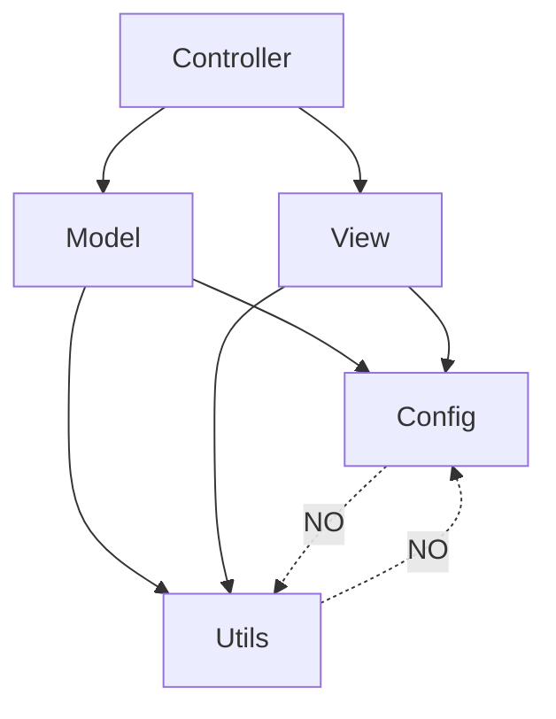
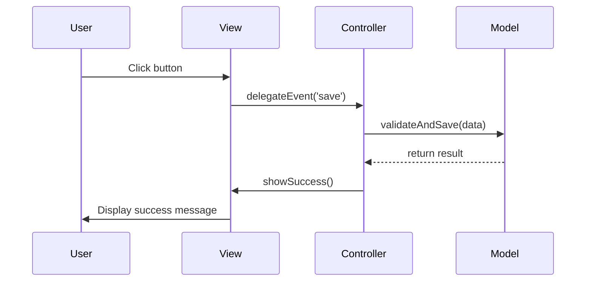

# Architecture Rules — MVC/MVVM Enforcement

Governance rules for maintaining clean architecture boundaries.
Violations cause architectural drift and maintenance debt.

---

## ARCH-RULE-001: Strict Layer Separation

**Status**: CRITICAL

| Layer | Directory | Dependencies Allowed | Forbidden |
|-------|-----------|---------------------|-----------|
| Model | `js/models/` | config/, utils/ | views/, controllers/, direct DOM |
| View | `js/views/` | models/ (read-only), config/ | controllers/, business logic, DB |
| Controller | `js/controllers/` | models/, views/, config/ | direct DOM manipulation |
| Config | `js/config/` | none | any other layer |
| Utils | `js/utils/` | none | any other layer |



---

## ARCH-RULE-002: Model Responsibility Boundary

**What Models CAN do**:
- Store and retrieve data
- Validate data integrity
- Calculate derived values
- Emit change events
- Connect to storage (localStorage, Firebase)

**What Models CANNOT do**:
- Manipulate DOM elements
- Handle user events directly
- Render UI components
- Make network requests (delegate to controller)

```javascript
// ✅ CORRECT Model
class ProfileModel extends BaseModel {
  validateProfile(data) {
    // Validation logic only
    if (!data.email•.includes('@')) {
      throw new ValidationError('Invalid email');
    }
    return true;
  }
  
  save(profile) {
    // Storage logic only
    this._saveToStorage(profile);
    this._notifyChange(profile);
  }
}

// ❌ WRONG — Model doing view work
class BadModel {
  renderProfile(profile) {
    document.getElementById('profile').innerHTML = ...;  // VIOLATION
  }
}
```

---

## ARCH-RULE-003: View Responsibility Boundary

**What Views CAN do**:
- Render data from model
- Bind events to controller
- Apply CSS classes for state
- Handle animations/transitions
- Display loading/error states

**What Views CANNOT do**:
- Contain business logic
- Modify model data directly
- Make API calls
- Store persistent state

```javascript
// ✅ CORRECT View
class ProfileView extends BaseView {
  render(profile) {
    // Pure rendering
    this.container.innerHTML = this._template(profile);
    this._bindEvents();
  }
  
  _bindEvents() {
    // Delegate to controller
    this.container.querySelector('.save-btn')
      .addEventListener('click', () => this.controller.onSave());
  }
}

// ❌ WRONG — View with business logic
class BadView {
  calculateDiscount(price) {
    return price * 0.9;  // VIOLATION — business logic in view
  }
}
```

---

## ARCH-RULE-004: Controller Responsibility Boundary

**What Controllers CAN do**:
- Coordinate between model and view
- Handle user input events
- Manage navigation/routing
- Validate user actions
- Trigger model updates

**What Controllers CANNOT do**:
- Render UI directly (delegate to view)
- Store persistent data directly (delegate to model)
- Know implementation details of model/view

```javascript
// ✅ CORRECT Controller
class ProfileController {
  constructor(model, view) {
    this.model = model;
    this.view = view;
  }
  
  async onSave() {
    try {
      const profile = this.view.getFormData();
      await this.model.validateAndSave(profile);
      this.view.showSuccess();
    } catch (error) {
      this.view.showError(error.message);
    }
  }
}

// ❌ WRONG — Controller doing view rendering
class BadController {
  onSave() {
    document.getElementById('status').textContent = 'Saved!';  // VIOLATION
  }
}
```

---

## ARCH-RULE-005: Event Flow Pattern

**Standard event flow**: User → View → Controller → Model → View update



**Violation Detection**: If event flow skips a layer, log warning.

---

## ARCH-RULE-006: Config Singleton Pattern

**All configuration must flow through appConfig.js**:

```javascript
// ❌ WRONG — Local constants
const MAX_TIERS = 74;
const PORTAL_NAMES = ['admin', 'mahamana', ...];

// ✅ CORRECT — Centralized config
import { APP_CONFIG } from '../config/appConfig.js';
const MAX_TIERS = APP_CONFIG.maxTiers;
const PORTAL_NAMES = Object.keys(APP_CONFIG.portals);
```

**Exception**: Build-time constants (webpack defines, env vars) are acceptable.

---

## ARCH-RULE-007: Utils Purity Rule

**Utility functions must be**:
- Stateless
- Pure (same input → same output)
- No side effects
- No dependencies on app state

```javascript
// ✅ CORRECT — Pure utility
export function escapeHtml(str) {
  const div = document.createElement('div');
  div.textContent = str;
  return div.innerHTML;
}

// ❌ WRONG — Utility with side effects
export function logAndEscape(str) {
  console.log('Logging:', str);  // Side effect
  return escapeHtml(str);
}
```

---

## Architecture Violation Scanner

Run these checks regularly:

```bash
# Check for model-view coupling
grep -rn "document\." js/models/ --include="*.js"

# Check for view-controller coupling
grep -rn "this\.controller\." js/views/ --include="*.js"

# Check for hardcoded values
grep -rn "const.*=.*['\"].*['\"]" js/ --include="*.js" | grep -v "appConfig"
```

---

*Architecture Rules Version: 1.0*
*Based on: Clean Architecture principles adapted for vanilla JS MVC*
