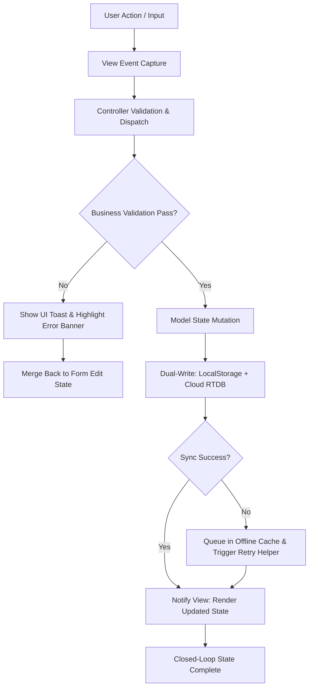
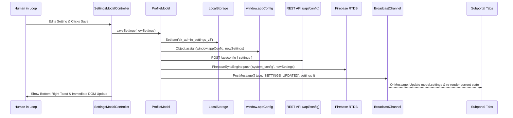

# Master Program Mapping & Relationship Table
**Shree Spritual Karim Sansthan — Enterprise MVC Architecture**  
*Document Version: 3.0.0 | ISO/IEC 25010 & Prime Directive Compliant*

---

## 1. Master Relationship Matrix

| Program ID | Layer | Source File | Core Responsibility | Upstream Dependencies | Downstream Integrations | Status |
| :--- | :--- | :--- | :--- | :--- | :--- | :---: |
| **MOD-01** | Model | `js/models/ProfileModel.js` | 74-Tier Profile CRUD, Lineage Tree builder, validation | `appConfig.js`, `sanitizer.js` | `ProfileController.js`, `ProfileView.js` | ✅ Active |
| **MOD-02** | Model | `js/models/ScreenAuthMatrix.js` | 170-node canonical RBAC matrix & permissions | `appConfig.js` | `ProfileController.js`, `ProfileView.js` | ✅ Active |
| **MOD-03** | Model | `js/models/FirebaseSyncEngine.js` | Dual-Write LocalStorage + RTDB, power-loss detection | `appConfig.js`, `retryHelper.js` | `ProfileModel.js`, `FirebaseService.js` | ✅ Active |
| **VIEW-01** | View | `js/views/ProfileView.js` | DOM rendering for dashboard, profile card, cards list | `sanitizer.js`, `ThemeEngine.js` | `ProfileController.js`, `index.html` | ✅ Active |
| **VIEW-02** | View | `js/views/ProfileView2.js` | Extended View prototype (Tier panel, badges, counts) | `ProfileView.js`, `sanitizer.js` | `ProfileController.js`, `index.html` | ✅ Active |
| **VIEW-03** | View | `index.html` (Canvas & Modals) | Master single-page app layout & 15-node navigation | `css/profile-admin.css` | All MVC components | ✅ Active |
| **CTRL-01** | Controller | `js/controllers/ProfileController.js` | Event coordination, tab routing, form dispatch | `ProfileModel.js`, `ProfileView.js` | Bootstrap, `index.html` | ✅ Active |
| **CTRL-02** | Controller | `js/controllers/ProfileController2.js`| Extended Controller prototype (modal actions, export) | `ProfileController.js` | `ProfileModel.js`, `ProfileView.js` | ✅ Active |
| **CTRL-03** | Controller | `js/controllers/SettingsModalController.js` | System settings, permission overrides & catalog edit | `ProfileController.js` | `admin-settings-modal` | ✅ Active |
| **CONF-01** | Config | `js/config/appConfig.js` | Single Source of Truth for constants, keys, flags | None (Root Config) | All client & server modules | ✅ Active |
| **UTIL-01** | Utils | `js/utils/sanitizer.js` | XSS prevention via `escapeHtml()` | None | All Views & Models | ✅ Active |
| **UTIL-02** | Utils | `js/utils/FormValidator.js` | Profile schema & field constraint validation | `schema.json` | `join.html`, `ProfileModel.js` | ✅ Active |
| **UTIL-03** | Utils | `js/utils/ThemeEngine.js` | Divine Gold dark/light theme switching | `appConfig.js` | `index.html`, `css/` | ✅ Active |
| **UTIL-04** | Utils | `js/utils/retryHelper.js` | Resilient network fetch with exponential backoff | None | `FirebaseSyncEngine.js` | ✅ Active |
| **BOOT-01** | Bootstrap| `js/profile-admin-bootstrap.js` | Environment polyfills, portal auto-detection & init | All MVC Layers | Browser DOMContentLoaded | ✅ Active |
| **BACK-01** | Backend | `server.js` | HTTP static file server & dynamic subportal router (SSOT Port 8085) | Node.js `http`, `fs`, `path`, `appConfig.js` | `routes.js`, all portals | ✅ Active |
| **BACK-02** | Backend | `Backend/api/routes.js` | REST endpoints (`/api/health`, `/api/config`, etc. on SSOT Port 8085) | `FirebaseService.js`, `AuthService.js` | `server.js` | ✅ Active |
| **BACK-03** | Backend | `Backend/services/FirebaseService.js` | Cloud RTDB gateway & offline fallback | `firebase-config.json` | `routes.js`, `SyncService.js` | ✅ Active |
| **SEC-01** | Security| `database/database.rules.json` | Authenticated read/write rules for RTDB | Firebase Rules Engine | Cloud RTDB Instance | ✅ Hardened |

---

## 2. Dynamic Variable Registry (Replacing Hardcoded Values)

| Variable Symbol | Config Key in `appConfig.js` | Default Value | Usage Scope |
| :--- | :--- | :--- | :--- |
| `STORAGE_KEY_PROFILES` | `storageKey` | `'sk_admin_profiles_v3'` | LocalStorage profile store |
| `STORAGE_KEY_MATRIX` | `authMatrixKey` | `'sk_auth_matrix_v5'` | LocalStorage auth matrix |
| `STORAGE_KEY_ROLE_MODE` | `roleModeKey` | `'sk_admin_active_role_mode_v1'` | Active portal role |
| `STORAGE_KEY_INVITES` | `pairingInvitesKey` | `'sk_pairing_invites'` | 24-hour device pairing queue |
| `STORAGE_KEY_THEME` | `themeKey` | `'sk_theme_preference'` | UI theme preference |
| `SERVER_PORT` | `server.port` | `8085` | Single Source of Truth active server port |
| `SERVER_HOST` | `server.host` | `'0.0.0.0'` | Single Source of Truth network interface |
| `SERVER_LOCAL_URL` | `server.localUrl` | `'http://localhost:8085'` | Canonical local portal URL |
| `SERVER_API_URL` | `server.apiUrl` | `'http://localhost:8085/api'` | Canonical REST API endpoint |
| `FIREBASE_RTDB_URL` | `firebaseUrl` | `'https://spritualkarim-7b5fd-default-rtdb.firebaseio.com/'` | Cloud database endpoint |
| `PAIRING_TIMEOUT_HRS` | `pairingInviteTimeoutHours` | `24` | Device pairing token life |
| `POWER_LOSS_INTERVAL` | `powerLossCheckIntervalMs` | `15000` | Unsaved data poll timer (ms) |

---

## 3. Closed-Loop State Transition & Branch Convergence

---

## 4. Rule 7: Enterprise Menu Drawer 15-Node Mapping

| Node # | Standard Name | Target Element ID | Action / Modal Destination | Role Access |
| :---: | :--- | :--- | :--- | :--- |
| **1** | Dashboard | `#nav-item-dashboard` | Switches to Tab 1 (`#tab-devotee`) Dashboard | All Roles |
| **2** | Children Devices | `#nav-item-children` | Opens MLM Hierarchy Tree (`#hierarchy-tree-modal`) | All Roles |
| **3** | Live Map | `#nav-item-live-map` | Opens `#modal-live-map` (Ashram Geo-Nodes) | All Roles |
| **4** | Location History | `#nav-item-location-history` | Opens `#modal-location-history` (Sadhana Attendance) | All Roles |
| **5** | MeetMyFriend Groups | `#nav-item-groups` | Opens `#modal-groups` (Satsang Circles) | All Roles |
| **6** | Safe Zones | `#nav-item-safe-zones` | Opens `#modal-safe-zones` (Protected Perimeters) | All Roles |
| **7** | Guardians / Family | `#nav-item-guardians` | Opens `#modal-guardians` (Guru Gotra Lineage) | All Roles |
| **8** | Notifications | `#nav-item-notifications` | Opens `#notifications-drawer` (System Telemetry) | All Roles |
| **9** | Device Health | `#nav-item-device-health` | Opens `#modal-device-health` (Node Diagnostics) | All Roles |
| **10** | Profile | `#nav-item-profile` | Switches to Devotee Profile Editor | All Roles |
| **11** | Settings | `#nav-item-settings` | Opens `#admin-settings-modal` | Master / Admin |
| **12** | Privacy Controls | `#nav-item-privacy` | Opens `#modal-privacy-controls` (GDPR/PII Audit) | All Roles |
| **13** | Help & Support | `#nav-item-help` | Opens `#modal-help-support` (Telegram / Hotline) | All Roles |
| **14** | About App | `#nav-item-about` | Opens `#modal-about-app` (ISO/IEC 27001 Standards) | All Roles |
| **15** | Logout | `#nav-item-logout` | Triggers `DemoAuth.logout()` & Redirects to `logout.html` | All Roles |

---

## 5. Enterprise UI/UX Component Suite Specification

| Component | Selector / ID | View / Controller Handler | Functional Behavior | Closed-Loop Resolution |
| :--- | :--- | :--- | :--- | :--- |
| **Segmented Toggle (Left/Right)** | `#view-mode-toggle` (`#btn-toggle-grid`, `#btn-toggle-list`) | `ProfileView.prototype.setViewMode` | Dual-state controller switching between Grid Cards and Compact List | Persists to `localStorage.sk_view_mode`, emits `showBottomRightToast` |
| **Enhanced Search Textbox** | `#input-tier-panel-search`, `#btn-clear-tier-search` | `ProfileController.prototype._bindEnhancedUIEvents` | Filter list box with real-time clear trigger and count badge sync | Updates active member count in `#tier-panel-count` |
| **3D Card Flipper** | `#btn-selected-member-flip`, `#selected-member-profile-card` | `ProfileView.prototype.flipSelectedMemberCard` | 3D perspective flip between Front Identity and Back Sadhana/QR stats | Toggles `.is-flipped`, triggers smooth toast feedback |
| **Rich List Box (Dropdown Details)** | `#dropdown-devotee-picker`, `#dropdown-devotee-items-list` | `ProfileView.prototype.populateDevoteeDropdown` | Searchable dropdown with member initials avatar, role, and city | On select: focuses member in workspace and displays notification |
| **Multi-Option Decision Dialog** | `#modal-multi-option-decision` | `ProfileView.prototype.showMultiOptionDialog` | 4-way HITL governance modal (`APPROVE`, `REVISE`, `ESCALATE`, `REJECT`) | Posts to `/api/profiles/decision`, logs to audit trail, closes modal |
| **Bottom-Right Slide Toast** | `#slide-toast-container-br` | `ProfileView.prototype.showBottomRightToast` | Smooth cubic-bezier slide-in notifications with progress bar & action button | Auto-dismisses with slide-out animation after duration timeout |
| **Mobile Hamburger Off-Canvas Drawer** | `#btn-mobile-sidebar-toggle`, `#admin-enterprise-drawer`, `#sidebar-backdrop` | `ProfileController.prototype.init` (Mobile Drawer Toggle) | Translates 275px fixed desktop sidebar into off-canvas sliding drawer with darkened blur backdrop on mobile/split-browser screens `<= 992px` | Eliminates 275px left offset, provides zero horizontal scroll, closes on backdrop tap or node navigation |

---

## 6. Backend REST Services & Database Referential Integrity Matrix

| Endpoint / Method | HTTP Verb / Type | Request / Input | Response / Mutation | Audit Logging |
| :--- | :--- | :--- | :--- | :--- |
| `/api/profiles/search` | `GET` | `?q=<term>&role=<role>&status=<status>` | Returns filtered profile list `{ success: true, count, data }` | Read-only telemetry |
| `/api/profiles/decision` | `POST` | `{ applicantId, decision, reviewerName, reason }` | Records HITL governance decision in persistent audit log | Appends to `telemetry.audits` |
| `/api/telemetry/notify` | `POST` | `{ title, message, type, recipientId }` | Broadcasts notification to cloud subscribers & audit log | Appends to `telemetry.audits` |
| `validateReferentialIntegrity()` | Method on `ProfileModel` | `{ autoRepair: boolean }` | Detects orphaned uplinks, circular loops, duplicate keys | Logs validation report |

---

## 7. Standard Enterprise Modals Interactive Action Mapping

| Modal ID | Name | Interactive Elements | Controller Handler | State Mutation & Feedback |
| :--- | :--- | :--- | :--- | :--- |
| `#modal-live-map` | Live Map | `.btn-center-ping` (4 centers) | `ProfileController` ping handler | Simulates geo-telemetry ping, updates `#live-map-telemetry-status`, shows toast |
| `#modal-location-history` | Location History | `#select-checkin-zone`, `#input-checkin-note`, `#btn-submit-location-checkin` | `ProfileController` check-in handler | Inserts verified check-in record into `#location-history-list`, shows toast |
| `#modal-groups` | MeetMyFriend Groups | `.btn-join-circle`, `#input-new-circle-name`, `#btn-create-new-circle` | `ProfileController` groups handler | Enrolls in circle or dynamically appends new group card to `#meetmyfriend-groups-list` |
| `#modal-safe-zones` | Safe Zones | `.safe-zone-switch`, `#input-custom-safe-zone-name`, `#btn-add-custom-safe-zone` | `ProfileController` safe-zones handler | Toggles geofence perimeters or adds custom geofence to `#safe-zones-container-list` |
| `#modal-guardians` | Guardians & Family | `#btn-guardian-copy-code`, `#btn-guardian-call`, `#btn-guardian-view-tree` | `ProfileController` guardians handler | Copies upline code to clipboard, opens mentor channel, or redirects to Tree view |
| `#modal-device-health` | Device Health | `#btn-run-device-diagnostics`, `#device-diagnostics-output` | `ProfileController` diagnostics handler | Audits heap memory, RTDB ping latency, and local storage quota |
| `#modal-privacy-controls` | Privacy Controls | `#chk-privacy-masking`, `#chk-privacy-minimization`, `#btn-export-gdpr-data`, `#btn-purge-local-cache` | `ProfileController` privacy handler | Toggles PII masking, triggers GDPR JSON download, or purges session cache |
| `#modal-help-support` | Help & Support | `#input-support-query`, `#btn-submit-support-query`, `#support-query-status` | `ProfileController` support handler | Generates support ticket, logs query, and displays ticket confirmation status |
| `#modal-about-app` | About App | `#btn-check-app-updates`, `#app-update-status` | `ProfileController` update check handler | Verifies running version v3.0.0 against remote build manifest |

---

## 8. Dynamic System Settings Dual-Write & Cross-Tab Synchronization

---

## 9. Authentication & Onboarding Workflow Steps

| Step | Component | Target Element / Route | Description / Functional Behavior | Target Audience |
| :---: | :--- | :--- | :--- | :--- |
| **1. Join** | `join.html` | `/join.html` | 5-Step Induction Wizard: Pairing → Identity → Contact → Guardian → Consent | New Seekers & Devotees |
| **2. Login** | `login.html` | `/login.html` | Select persona role (Master, Healer, Trainee, Devotee), authenticate, load token | Registered Users |
| **3. Logout**| `logout.html`| `/logout.html` | Execute `DemoAuth.logout()`, purge local tokens/session, and provide re-entry paths | All Roles |
